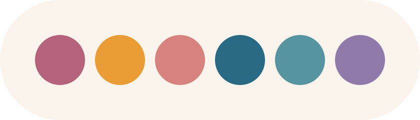

# Rosé Pine Resume

A clean, minimal resume/portfolio site built with Next.js and the elegant [Rosé Pine](https://rosepinetheme.com/) color palette.

<p align="center">
  
  
  
</p>

## Features

- Beautiful Rosé Pine theme
- Multi-language support
- Responsive design
- Next.js 15
- SEO-optimized

## Quick Start

```bash
# Install dependencies
pnpm install

# Start dev server
pnpm dev
```

Open [http://localhost:3000](http://localhost:3000) in your browser.

## Customization

All content is stored in the `src/data` directory:

- `basics/` - Your personal info (contact, skills, socials, meta tags)
- `experience/` - Work history
- `intro/` - Introduction section (markdown)
- `faq/` - About Me sections (markdown)

Images and icons can be replaced in the `public` directory:

- `avatar.jpg` - Your profile picture
- `favicon.ico` - Browser tab icon

To add languages, update the `LANGUAGES` array in `src/config.ts` and create corresponding data files.

## Deployment

Deploy on Vercel, Netlify, or any platform supporting Next.js:

```bash
pnpm build && pnpm start
```

## License

[MIT](LICENSE)

## Acknowledgements

- [Rosé Pine](https://rosepinetheme.com/)
- [Next.js](https://nextjs.org/)
- [Tailwind CSS](https://tailwindcss.com/)
- [Content Collections](https://contentcollections.dev/)

Brewed with ☕ by [Hugo Wantuil](https://github.com/hugw)
